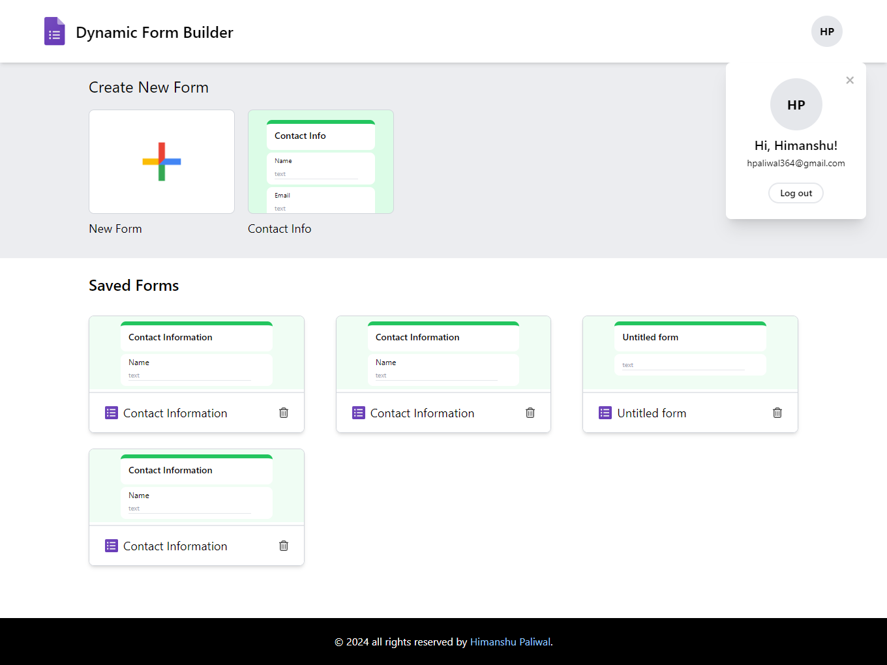
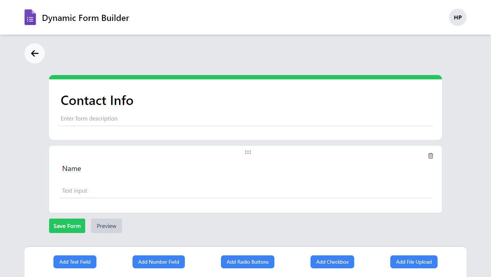
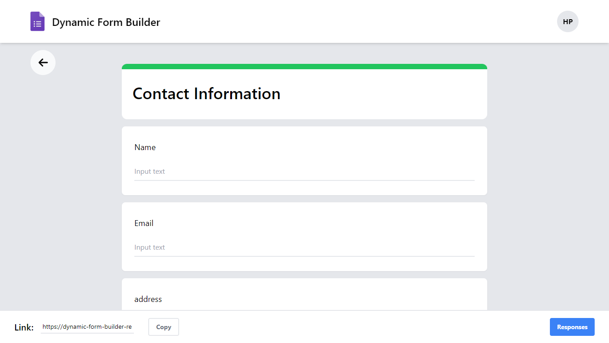
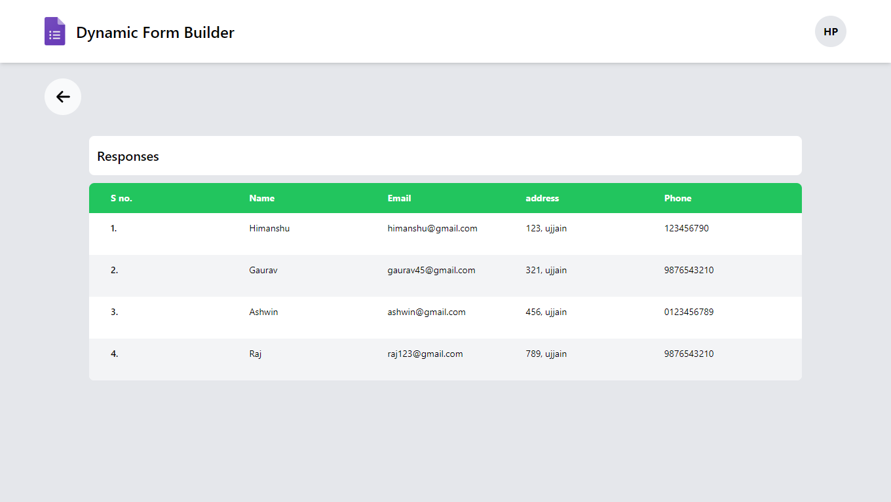
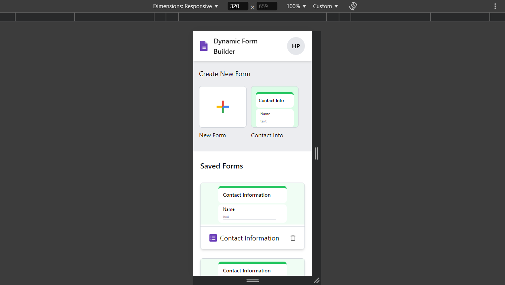
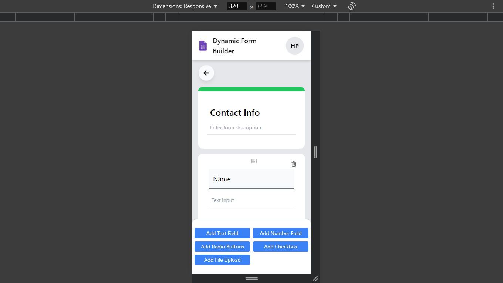
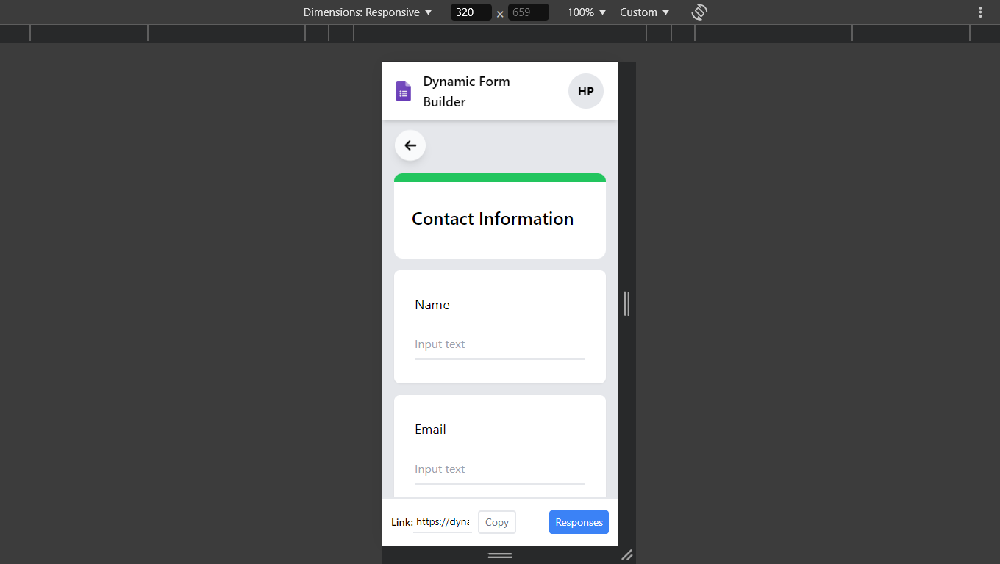
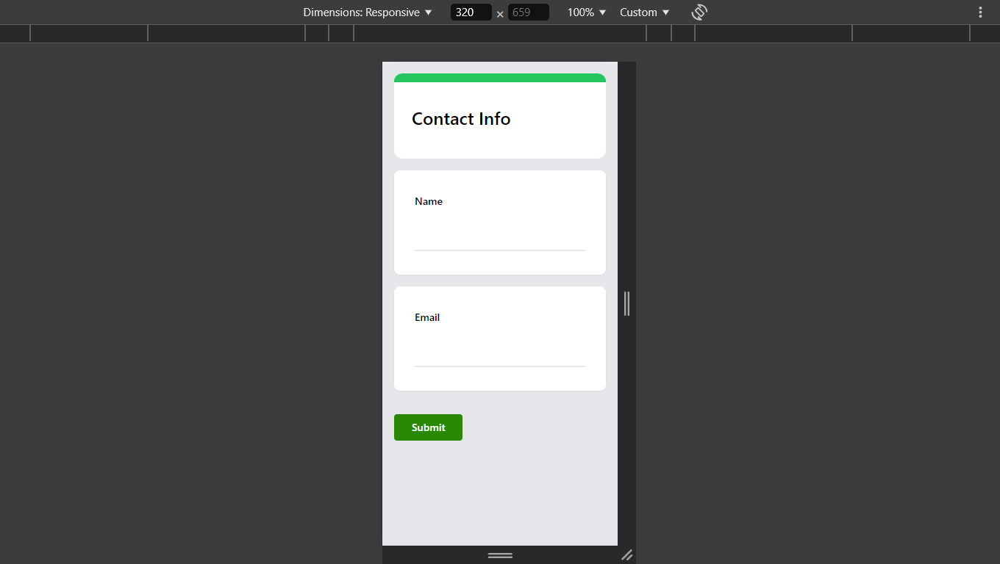

# Dynamic Form Builder

**Dynamic Form Builder** is a full-stack MERN application that empowers users to create, save, and share forms similar to Google Forms. Users can view submitted responses, making it a valuable tool for surveys, feedback, or data collection needs. The project is fully responsive and accessible on both mobile and desktop devices.

## Features

- **User Authentication:** Users can sign up and log in to access personalized functionalities.
- **Form Creation & Customization:** Create custom forms easily and save them for later use.
- **Form Sharing:** Share forms via unique links, enabling others to submit responses.
- **Response:** View all responses submitted to your forms.
- **Demo Form:** Pre-filled demo contact form for quick editing and saving.
- **Responsive Design:** Fully responsive and accessible on both mobile and desktop devices.

## Technologies Used

- **Frontend:** React, tailwindcss (deployed on [Netlify](https://netlify.com))
- **Backend:** Node.js, Express (deployed on [Render](https://render.com))
- **Database:** MongoDB (using MongoDB Atlas on AWS)

## Deployment Links

- **Live Project:** [Dynamic Form Builder](https://dynamic-form-builder-react-js.netlify.app)
- **Backend API:** [Render API Link](https://dynamic-form-builder-backend.onrender.com)

## Installation & Setup

1. **Clone the Repository**
   ```bash
   git clone https://github.com/himanshu-paliwal-277/Dynamic-Form-Builder-React
   ```
   
2. **Install Dependencies**
   ```bash
   cd Dynamic-Form-Builder-React
   npm install
   cd Dynamic-Form-Builder-React
   npm install
   ```

3. **Environment Variables**
   Create a `.env` file in the root and add your environment variables as per your backend and database setup.

4. **Run the Application**
   ```bash
   npm run dev
   ```

## Screenshots

### Desktop View

#### Home Page


#### Form Builder


#### Form Preview


#### Form Responses


#### Mobile View

#### Home Page


#### Form Builder


#### Form Preview


#### Form Fill Page
